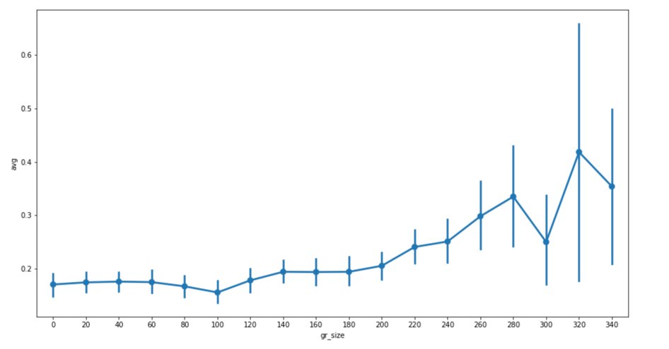

## dating recommendation

* Ссылка на постоянный созвон: [zoom](https://us02web.zoom.us/j/84017944503?pwd=Y3paWTUzbXkrQWU2RGkyb21nQk1wdz09)

## Статус 28.03.2022

Мотивирующая картинка
##

Решили что будем учить рекомендательную модель, которая будет прогнозировать насколько одному эмбеддингу понравится другой. Прогнозировать будем на основании трёх видов даннх (картинка, граф, текст, атрибуты). При этом модель нужно учить отдельно для newcommer'ов, отдельно для опытных пользователей т.к. у первых еще нет сетевого эмбеддинга.

## Для общего развития
Стенфордский курс по SNA [notion](https://www.notion.so/yads/Sberloga-with-Graphs-12fafe3224e1483eb435a16aa990e1a1)

Как учить GAT можно найти тут: [colab](https://github.com/gordicaleksa/pytorch-GAT/blob/main/The%20Annotated%20GAT%20(Cora).ipynb), но если лень разбираться, то он есть в [stellar graph](https://stellargraph.readthedocs.io/en/stable/)

## Обзор литературы
Берем хороший обзор по SNA link prediction, например A Survey of Link Recommendation for Social Networks: Methods, Theoretical Foundations, and Future Research Directions [acm](https://dl.acm.org/doi/10.1145/3131782), [pdf](https://dl.acm.org/doi/pdf/10.1145/3131782) и смотрим [кто его процитировал в google scholar](https://scholar.google.com/scholar?hl=ru&as_sdt=2005&sciodt=0%2C5&as_ylo=2018&cites=13239567524783213560&scipsc=1&q=graph+attention+networks&btnG=&oq=graph+attention+)

Среди релевантных сразу находим статью из [Q1](https://www.scimagojr.com/journalsearch.php?q=17362&tip=sid&clean=0) журнала 2022 года: "[What You Like, What I Am: Online Dating Recommendation via Matching Individual Preferences with Features](https://ieeexplore.ieee.org/abstract/document/9706322)" [pdf](https://dl.dropboxusercontent.com/s/i5bowxdgt3h08wc/What_You_Like_What_I_Am_Online_Dating_Recommendation_via_Matching_Individual_Preferences_with_Features.pdf)

Также стоит посмотреть:
"[Reciprocal and heterogeneous link prediction in social networks](https://dl.acm.org/doi/10.1007/978-3-642-30220-6_17)" PAKDD'12 - старенькая, лучше сразу смотреть кто цитировал

# К след . разу:
1. Выгрузить данные из Dating бота в формате
    * Nodes
        * id
        * gender
        * reg date
        * …
     * Edges
         * id
         * node id A
         * node id B
         * timestamp
         * type
2. Загрузить данные в [NetworkX](https://networkx.org/documentation/stable/reference/readwrite/index.html) и прогнать их через простенькие link prediction модели:
    * Простые модели прогнозирвания, такие как preferential attachment, Adaic, Jaccard можно посмотреть тут: [colab](https://drive.google.com/file/d/1IVfBKPJo2rPHXgNim73WyYrj_ACtubcU/view?usp=sharing)
    * Чуть более умные модели на основании случайных блужданий и skipgram тут: [colab](https://drive.google.com/file/d/1PYNFGH5kHZwrX_hCykIyJpD6tyqZWioN/view?usp=sharing)
3. Сделать обзор литературы по гайду выше в формате <статья><ключевая идея><что понравилось><что не понравилось>

## Потом
* Сделать описание сети (@ki расскажет как)
* Начать разбираться с GAT

## Статус 07.05.2022
### 1. Выгрузка данных и их очистка
[Выгрузил данные в 2 таблички](https://drive.google.com/file/d/1d4UpPeKHibnjr85ryU5AjqNfawxJPC0k/view?usp=sharing). Но есть нюанс - id это строчка начинающаюся с _. Это хеш телеграмного id с солью (В базе у нас только telegram_id, внутреннего нету). 
Это id я называю в ноутбуках dumb_id. 
Ещё если Петя вобьет в боте /photo dumb_id_1 dumb_id_2 ... то бот скинет фотки этих людей в порядке как они указаны.

Из-за того что мы хранили ребра по-тупом (по каждому человеку, по кажому типу список предктов и потомков) времени когда ребра появлялись нет, но есть *enum_number* - это индекс в списке **исходящих** рёбер у соответствующей вершины. 
Номер ребра в списке входящих я делать не стал, потому что там много не метчилось. Id ребра мне нигде не пригодилось, так что это закоментил. 
Если человек помечал анкету как нейтральную, а потом лайкал, то я проводил ребро как лайк. Дальше я считаю, что лайк или анонимный лайк это ребро (edge_type=pos), а нейтрально или дизлайк - нет (edge_type=neg).

[Выгрузил картинки из s3](https://drive.google.com/file/d/13-gABQN4SvdRBynfAl2k1xRiMEq4oDeW/view?usp=sharing). Но как привести к общему виду не понял. Рандомная сетка, которая делает ембединги не заработала из-за greyscale картинок, по-быстрому пофиксить не смог.

### 2. Граф
[Сделал направленный граф](https://drive.google.com/file/d/1d4UpPeKHibnjr85ryU5AjqNfawxJPC0k/view?usp=sharing). Ребра провел все - и по лайкам и по дизлайкам. 
Убрал гей ребра. Убрал изолированные вершины. Перенумеровал вершиные в графе, так чтобы номера шли от 0 последовательно.
Dumb_id вершины лежит в ее параметрах.

Немного статки подсчитал, чтобы понять что это вообще за граф. 
Ниже под лайком я буду понимать лайк или анонимный лайк. Для начала посмотрим на распредение степеней вершин. Видно, что многие не лайкают и просто заходят посмотреть.  

Всего 425к лайков. Метчей 43.6к Вот как лайки распределены по тому кто кого лайкает.

    male->male       1.22%  or    5168
    male->female    65.76%  or  279502
    female->male    29.00%  or  123285
    female->female   4.02%  or   17106

Оценок всего 2.1М. Они распределены ровнее
    
    all edges male->male      1.57%  or   33150
    all edges male->female   50.20%  or 1060399
    all edges female->male   43.79%  or  924954
    all edges female->female  4.43%  or   93639

Ну и посчитаем теперь какая доля от возможных ребер (если бы был полный граф) реально есть, и какая доля из них - лайки

    % existing edges from full graph m <> f 30.35%
    % existing edges from full graph m -> f 32.43%
    % existing edges from full graph f -> m 28.28%
    
    
    % liked from existing edges m <> f 20.36%
    % liked from existing edges m -> f 26.47%
    % liked from existing edges f -> m 13.36%
    
    
    % liked from full graph m <> f 6.18%
    % liked from full graph m -> f 8.58%
    % liked from full graph f -> m 3.78%

Довольно много *нетрадиционных* ребер. Посмотрим на распределение ориентаций

    male orientations %:
    bi       8%
    gay      9%
    nat     84%

    female orientations %:
    bi      26%
    gay     4%
    nat     70%

Выводы:
- Несмотря на то что много людей помечают себя как би, основная доля ребер все-таки идёт *натурально*. Чтобы упростить задачу, оставим только натуральные ребра. 
- Средени оцененных ребер лайков **много** - в среднем 20%. Если бы все всех оценили, граф вышел бы совсем не разреженным. Поэтому я считаю, что нельзя по дефолту помечать отсутствующие ребра как негативыне, как это обычно делают
- Входящая степень лайков довольно сильно неровная -> все лайкают одинх и тех же людей -> ранжирование по популярности неплохо зайдет

### 3. Несложные методы предсказания
##### Test/train
В ноутбуках я относительно много поменял. В test/train split ребра это лайки, 
а false ребра это теперь не все остальные, как обычно делают в разреженных графах, а neg ребра. 
Среди этих ребер нет ребер m->m или m->f для геев, так что наш алгос работает уже поверх логики, кто кого может оценивать.
Те чтобы получать его предсказания в реальном мире, надо будет ему скармливать только валидные пары.

##### Метрики
Ещё меня смутили метрики. В статьях используют обычно f1, ap, auc. Однако я не смог осознать их смысл с продуктовой точки зрения.
Так что я буду дополнительно считать метрику, которую используют для рекомендательных систем. Я буду называть ее хитрейтом, обычно обозначают её **@Pn**. 
Чтобы посчитать, идем по всем вершинам и для каждой смотрим на все возможные элементы, которые можно ей порекомендовать (все возможные ребра из этой вершины), сортируем их по 
убыванию релевантности, берем топ **n** из них. И потом делим количество ребер которые мы порекомендовали и они реально есть 
на общее количество рекомендаций.

Чтобы считать корректно, я считаю эту метрику только по тестовым ребрам, те я могу рекомендовать только их. Однако из-за 
того что я ребра распределяю случайно, есть вершины с маленькой исходящей степенью. Для них если **n** больше чем их степень, 
я считаю, что порекомендовал все ребра. Из-за этого для случайных рекомендаций график @Pn от n - это не прямая линия. Потому что 
если pi - шанс что случайное ребро положительное для ребер исходящих из iй вершины, то @Pn = Sum(pi * wi) / sum(wi) где
веса это размеры рекомендаций. И когда обрезания нет - все веса одинаковые и это просто среднее вероятностей, а когда есть - 
у обрезанных, те вершин с маленькой степенью, вес меньше чем у тех, кого степень большая. А доля лайков по степени вершины 
распределена не равномерно. Ниже график @Pn от n. Синяя линия - по всем вершинам, рыжая - по ребрам со степенью >100.

А вот средняя доля исходящих ребер по вершинам в зависимости от их степени с ci=95%

*по y - среднее средней доли лайков среди всех исходящих тестовых ребер. \
По x - исходящая степень округленная до 20 вниз*

Получается, что результат рандомного классификатора не прямая линия - он колеблется от 19% до 20%. Однако по сравнению с 
дргуими методами, это колебание довольно маленькое и на общем графике, довольно близко к горизонтальной линии.
Все эти картинки посчитал в [ноутбуке с node2vec](https://drive.google.com/file/d/1SzQMUemvPpnABf-FVCE9aQwMNjtyU0dd/view?usp=sharing)

##### Простые вероятностные методы
Всё в этом [ноутбуке](https://drive.google.com/file/d/1F7HJzGhtPVY1UeltAEFVOtVtlnSva_d8/view?usp=sharing). Простые методы, которые Adamic/Adar и другие, сделаны для ненаправленных графов. При этом у нас еще и граф двудольный. 
Поэтому чтобы побыстрее перейти к норм методам, я решил прогнать только preferential attachment, где считал
вероятность ребра a->b ~ deg_out(a) * deg_in(b). Получилось довольно хорошо: 
    
    @P10    34.6%
    AP      0.54
    ROC     0.79

Насчет адаптации методов про общих друзей я думал сделать, что p ребра ~ как часто оно встречается у других людей вместе с 
другими вершинами которые тебе уже понравились. Те по всем u и v как часто встречается такая ситуация. Но я забил и решил 
пойти дальше

##### Node2vec
Всё в этом [ноутбуке](https://drive.google.com/file/d/1SzQMUemvPpnABf-FVCE9aQwMNjtyU0dd/view?usp=sharing). Тут все довольно понятно. Единственное, что я поменял это то, как мы считаем эмбединг ребра. Из-за 
того, что граф направленный нелогично считать эмбединг симметрично. Я попробовал разность и конкатенацию.
Конкатенация зашла лучше

    Haddamard:
    @P10    24.4%
    AP      0.24
    ROC     0.57

    Concat:
    @P10    33.1%
    AP:     0.47
    ROC:    0.77

    Diff:
    @P10    29.3%
    AP      0.41
    ROC     0.73

С гиперпараметрами я немного поигрался с руками с p, q, длинной и количество прогулок. Получилось p=1, q=2, NUM_WALKS=50, WALK_LENGTH = 10 лучше всего. Правда смотрел я это тоже на тесте.
Цифры выше при оптимальных параметрах

Вот график @Pn со всеми методами 

### 4. Обзор литературы
Блин, я не смог и сделал [в ноушене](https://www.notion.so/transition-pages/2199b5545075435e85dab57e88bd50cd). Потом буду переносить все сюда. 
Посмотрел на статьи про графовые эмбединги и про рексис для китайского дейтинг сайта. 
Как буду идти дальше, буду добавлять статьи по ходу.